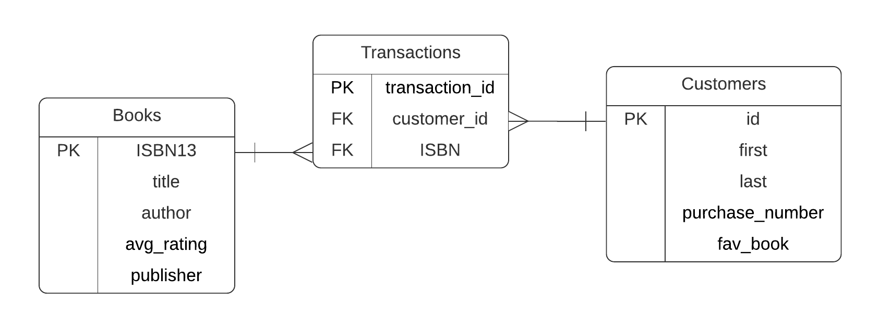

```{r setup, include=FALSE}
knitr::opts_chunk$set(echo = FALSE)
library(tidyverse)
```
# Introduction

## Introduction | Roadmap

- Introducing Scenario
- Database Concepts & Motivation
- Data Model 
- SQL 
  - Language 
  
  - SELECT
  - WHERE
  - GROUP BY 

## Introduction | Our Scenario Today

We are running a bookstore collectively (just like the left-wing leaning bookstore on campus
**The Groundwork Books Collective**). How do you manage your book inventory? 

- What are some **common operations** that you want to do to your inventory? (CRUD)
- What are some **tool(s)** that you can think of to support your operation on the inventory?
- With these tool(s), what are some **problems** that might emerge in the foreseeable future?

Using database and database management system, many of these concerns will be addressed.

Note: These problems and solutions are generalizable.

<div class = "notes">
* CRUD - Create, Read, Update, and Delete
* Tools - Google sheet, excel, Notion
* Limitations: 
  * Update - Manual work, error prone. (The inventory is still a mess)
  * Read - not efficient (customer ask if we have a book)
  * Delete - on no
</div>

## Introduction | Database related concepts 

- **Database**: Shared collection of related data used to support the activities of
a particular organization.
- **Database Management System(DBMS)**: Programs that support CRUD operations and control
all access to databases.
  - Provide an environment that is both **convenient** and **efficient** for
  users to retrieve and store information
- **SQL**: Structured Query Language - language used to talk to DBMS

<center>
{height=30% width=50%}
</center>

## Introduction | Formalized Motivation

- **Automation**. Interface linking to other programs
- **Summary Statistics**. Help you generate the report 
- **Enforcement of Integrity constraints**. Rules to constraints that users
enter valid information (**data type!**)
- **Multiuser system**. Control for access, data sharing 
  - e.g. Read and write, read-only
- **Backup and recovery facilities**. 

# Data Model
## Data model | A bird-eye view of our data

```{r include=F}
books <- read_csv("data/books.csv")
books <- books %>% mutate(ISBN13 = as.character(ISBN13))
customers <- read_csv("data/customers.csv")
transactions <- read_csv("data/transactions.csv")
```

```{r echo=T}
books
```
---

```{r echo=T}
customers
```
---
```{r echo=T}
transactions
```

## Data Model | Entity-Relationship Diagram
<center>
{width=80%}
</center>

## Data Model | Anatomy of a Database

- **Primary Key**: The column that uniquely identify each row in a table
- **Foreign Key**: A column in a table that references the primary key in another table

<center>
{width=80%}
</center>

**Question**: There is a missing relation. Can you spot it?

# SQL

## SQL | Introduction
- SQL stands for **S**tructured **Q**uery **L**anguage 
- Use SQL to talk to a DBMS
- Pronounced "SQL" or "Sequel"
- It is the amalgamation of 
  - a data query Language (R) <div class="blue"> Our Focus </div>
  - a data definition language (C)
  - a data control language (Access)
  - a data manipulation language (UD)
  
## SQL | Introduction
- SQL is formally defined, but implemented differently 
  - **Incompatibility**, but very similar. You only need to learn it once.
  - Popular Extensions: MySQL, PostgreSQL, 
  - We will be using **SQLite**
  
 - Run from 
  1. command line prompt
  1. Dedicated Program like DB Browser
  1. Other programming languages such as Python and R, with dedicated libraries 
  
## SQL | Language & Syntax
- **Case Insensitive!**
  - UPPERCASE FOR KEYWORDS
  - lowercase for anything else
- End your statement with ';'
  - empowers nice formatting

## A Tour of DB Browser | Open Existing Database

<center>
{width=100%}
</center>

## A Tour of DB Browser | Database Structure
<center>
{width=100%}
</center>

## A Tour of DB Browser | Browse Data
<center>
{width=100% height=80%}
</center>
## A Tour of DB Browser | Execute SQL
<center>
{width=100%}
</center>


## Non-relational Operations | Overview

- If you have taken the R module, you know them all already

{width=80% height=80%}
---


## Non-relational Operations | Overview

- Select columns: SELECT column(s) FROM table
- Select unique rows: SELECT distinct rows from your table
- Sort by a column: ORDER BY a column
- Filter rows by a condition: WHERE [criteria]
- Calculate new values on the fly
- Calculate summary statistics with functions
- Aggregate over groups: GROUP BY

## SELECT

```{sql eval=F,echo=T}
-- syntax
SELECT [column(s)] FROM table;
```

Select 'title' and 'author' column from table 'books'
```{sql eval=F,echo=T}
SELECT title, author FROM books;
```

In R:
```{r eval=F, echo=T}
books %>% select(title, author)
```

## SELECT | SELECT *

- Select all columns in a table
- Note '*' is called wild card
```{sql eval=F, echo=T}
-- syntax
SELECT * FROM [table]
```

Select all columns in table books
```{sql eval=F, echo=T}
SELECT * FROM books;

```

```{r eval=F, echo=T}
books %>% select_all()
```

## SELECT | SELECT DISTINCT

Select distinct rows from selected column(s) in a table
```{sql eval=F, echo=T}
SELECT DISTINCT [column(s)] FROM [table];
```

**Question**: How many books are sold (not how many total copies of books)?
```{sql eval=F, echo=T}
SELECT DISTINCT ISBN FROM transactions;
```

In R:
```{r eval=F, echo=T}
transactions %>% select(ISBN) %>% unique()
```

## SELECT | ORDER BY

- Select out columns from table, ordered by column(s), in ascending order (or descending order)
```{sql eval=F, echo=T}
SELECT [column(s)] FROM [table] ORDER BY [column(s)] [DESC];
```

**Question**: Explain this statement in plain English
```{sql eval=F, echo=T}
SELECT title, author FROM books ORDER BY author DESC;
```

```{r eval=F, echo=T}
books %>% select(title, author) %>% arrange(author) # ascending order
books %>% select(title, author) %>% arrange(desc(author)) # descending order
```

## Question

Using SELECT and ORDER BY, find out who purchased the most books. 

Hint: Sort the customers table by what column? In which order? 

## Review | Concepts

- What is the distinction between Database, Database Management System, and SQL?
How do they relate to each other?
- What is a foreign key? What is a primary key? Why are they important to a
relational database?
- What are two language features of SQL (Case sensitive? End statements with?)

## Review | SQL
```{SQL echo=T, eval=F}
SELECT [column(s)] FROM [table];
SELECT * FROM [table];
SELECT DISTINCT [column(s)] FROM [table];
SELECT [column(s)] FROM [table] ORDER BY [column(s)] [DESC];
```

- Write a query to select the first and last name from `Customers` table
- Write a query to select the entirety of the `Customers` table 
- Write a query to find out how many **distinct** customers have purchased books
from the `Transactions` table
- Write a query to sort the `Books` table using the `title` column, in descending order.

## Today

- WHERE
- Calculation on the fly
- Aggregate Function
- Group By

## Boolean Algebra

* Two values: TRUE, FALSE
* Operators: AND(&), OR(|), NOT(!)

### AND

| AND | TRUE | FALSE |
|-----|------| ----- |
|TRUE | TRUE | FALSE |
|FALSE| FALSE| FALSE |

---

### OR 

| OR  | TRUE | FALSE |
|-----|------| ----- |
|TRUE | TRUE | TRUE  |
|FALSE| TRUE | FALSE |

### NOT

| NOT | TRUE | FALSE |
| ----| ---- | ----- |
|     | FALSE| TRUE  |

## Boolean Algebra | Practice

* (1 < -1) OR  (0 == 0)
* (1 < -1) AND (-1 < 2)

## WHERE 

- Use WHERE clause to keep rows according to a certain criteria
```{sql eval=F, echo=T}
-- syntax
SELECT [column(s)] FROM [table]
WHERE [criteria return True];
```

Who purchased more than 1 books?
```{sql eval=F, echo=T}
-- notice how purchase_number is NOT in the outcome
SELECT first, last FROM customers
WHERE purchase_number >= 2;
```

In R:
```{r eval=F, echo=T}
customers %>% filter(purchase_number >= 2) %>% select(first, last)
```

## WHERE | compound criteria, LIKE, IN

Whose First name started with letter A or L?
```{sql eval=F, echo=T}
SELECT first, last FROM customers
WHERE (first LIKE 'A%') OR (last LIKE 'L%');
```

What books did customers whose id is 11111 and 11112 purchase?
```{sql eval=F, echo=T}
SELECT * FROM transactions 
WHERE customer_id IN (11111,11112);
```

**Question (manual join)**: I also want to know who these customers and what books are. Using WHERE, how can I find out about these information?

---

**Question**: I want to check who purchased between 1 and 3 books. What is wrong with the following code?
```{sql eval=F, echo=T}
SELECT first, last, purchase_number FROM customers
WHERE (purchase_number > 1) OR (purchase_number < 3);
```

--- 
Or in R:
```{r eval=F, echo=T}
customers %>% filter(purchase_number > 1 & purchase_number < 3)
```

## Calculation on the fly | '||', Renaming using AS 

Column-wise operations:
```{sql eval=F, echo=T}
SELECT first || ' ' || last AS full_name
FROM customers;
```

## Aggregate Function

```{sql eval=F, echo=T}
-- syntax
SELECT [function(column(s))] FROM [table]
```

What is the average rating of the books?
```{sql eval=F, echo=T}
SELECT avg(avg_rating) FROM books;
```

- List of aggregate functions
  - avg(X)
  - count(X)
  - min(X)
  - max(X)
  - sum(X)
  
## Aggregate Function | Practice

**Question**: What is the total number of purchases in *Transactions* table?
What is the total number of purchases in *Customers* table? Do they match? This
illustrate the principle of **single source of truth**

## Group By

- Usually used with aggregate functions

```{sql eval=F, echo=T}
-- syntax
SELECT [function(column(s))] FROM table 
GROUP BY [column(s)];
```

Example: What is the number of purchases by each person in transaction table?
```{sql eval=F, echo=T}
SELECT customer_id, count(*) FROM transactions
GROUP BY customer_id;
```

In R:
```{sql eval=F, echo=T}
transactions %>% group_by(customer_id) %>% summarize(n = n())
```
whose record did we miss?

## Join

Combine data from multiple tables

```{sql eval=F, echo=T}
SELECT [table1.column(s), table2.column(s)] FROM [table1 JOIN table2]
ON [table1.columnX == table2.columnY, ...];
```

How do we get information about each customers' `fav_book`? Not just the ISBN,
but the title, author...

Can we do:
```{sql eval=F, echo=T}
SELECT Customers.last || " " || Customers.first, Customers.fav_book, Books.ISBN13, Books.title, Books.author
FROM Customers JOIN Books;
```
What did that statement do?

## Join
To tell SQL the specific columns we are joining, use `ON`: 

```{sql eval=F, echo=T}
SELECT Customers.first|| " " || Customers.last, Customers.fav_book, Books.ISBN13, Books.title, Books.author
FROM Customers JOIN Books
ON Customers.fav_book == Books.ISBN13;
```

**Question**: 
1. Use `Where`, filter out all the transactions made to customers whose IDs are `11111` and `11112`
2. Use `JOIN`, find out who they are, and 
3. Use `JOIN`, find out what books they purchased.
 
## RSQLite | SQLite in R

## Where to go from here?

[Software Carpentry](http://swcarpentry.github.io/sql-novice-survey/)

Big data - Google [BigQuery](https://cloud.google.com/bigquery/)!


